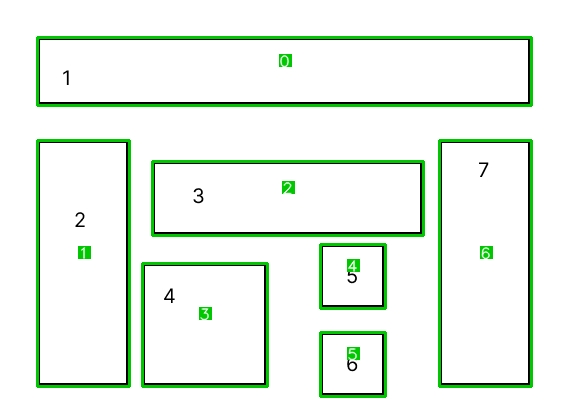
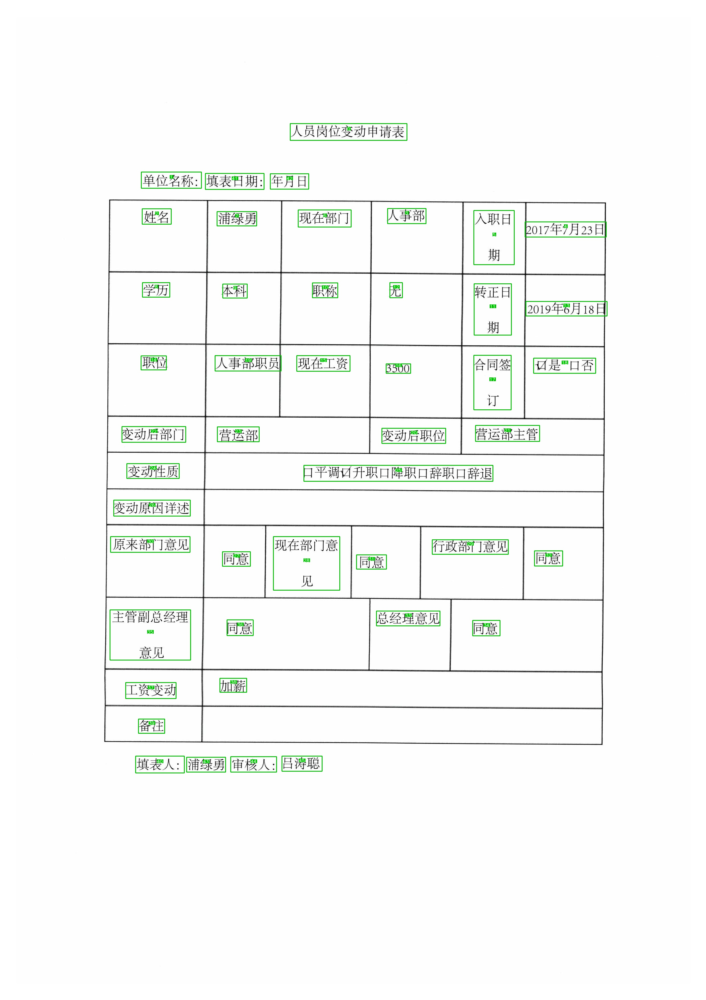
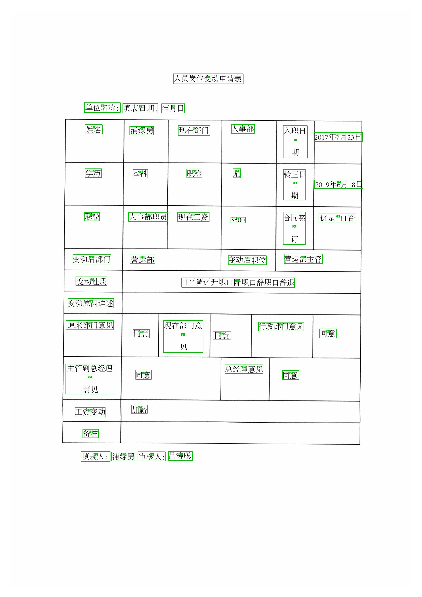

Implement XY Cut Algorithm used in [《XYLayoutLM: Towards Layout-Aware Multimodal Networks For Visually-Rich
Document Understanding》](https://arxiv.org/pdf/2203.06947.pdf)

Run on example: `python3 run_example.py`

Run on XFUN example: `python3 run_xfun.py`

| Original Order                          | XY Cut                             |
| --------------------------------------- | ---------------------------------- |
|  |  |
